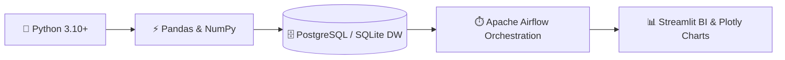
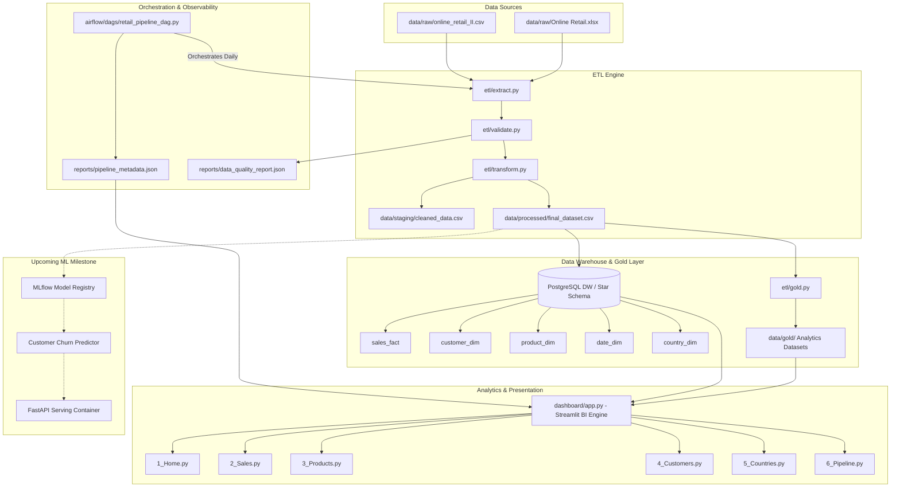
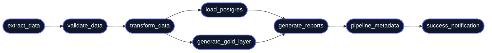

<div align="center">

# 🛍️ RetailSense-AI

### End-to-End Retail Analytics & Data Engineering Platform
**An End-to-End Data Pipeline, Star Schema Warehouse, Gold Analytics Layer, Airflow Orchestration & Streamlit BI System**

[](https://www.python.org/)
[](https://airflow.apache.org/)
[](https://www.postgresql.org/)
[](https://streamlit.io/)
[](https://plotly.com/)
[](LICENSE)

---

</div>

## 📌 Project Banner

```text
========================================================================================
 🛍️  RetailSense-AI  |  END-TO-END RETAIL ANALYTICS & DATA ENGINEERING PLATFORM
----------------------------------------------------------------------------------------
 📦 Raw Transactions (1.61M Rows) ➔ 🧹 Automated Quality Audit ➔ ⚡ PostgreSQL Star DW
 📊 Gold Analytics Layer ➔ ⏱️ Airflow Daily Orchestration ➔ 📈 Interactive Streamlit BI
========================================================================================
```

> [!IMPORTANT]
> **RetailSense-AI** is an enterprise-style, modular data engineering and business intelligence platform built to process multi-year retail transactions at scale. It implements rigorous data quality checks, relational star schema warehousing, pre-calculated analytical gold layers, and real-time pipeline health tracking.

---

## 🚧 Project Status

**Current Version**: `v1.1`

### Completed Phase (`v1.0` & `v1.1`)
- ✅ **ETL Pipeline**: Automated multi-source extraction, cleaning, and schema normalization.
- ✅ **Data Warehouse**: PostgreSQL Star Schema DW with relational facts and dimension tables.
- ✅ **Airflow DAG**: 8-stage scheduled orchestration workflow with execution logging.
- ✅ **Dashboard**: Multi-page Streamlit BI dashboard with 15+ interactive Plotly charts.
- ✅ **Customer Churn Label Generation**: Automated 90-day inactivity churn labeling & dataset creation (`data/ml/customer_churn_dataset.csv`).

### In Progress (`v1.2`)
- 🚧 **Machine Learning Pipeline**: XGBoost Churn Model Training, Evaluation & Feature Engineering.

### Planned (`v1.3+`)
- 📌 **MLflow**: Model experiment tracking and model registry.
- 📌 **FastAPI**: RESTful API endpoints for real-time model predictions.
- 📌 **Docker**: Containerization with Docker Compose.
- 📌 **CI/CD**: GitHub Actions automated testing and deployment.

---

## 📊 Repository Statistics

| Dimension | Metric / Count |
|---|---|
| **Python Files** | `26` scripts |
| **Modular Core Components** | `7` modules (`etl`, `database`, `dashboard`, `airflow`, `reports`, `data`, `tests`) |
| **Streamlit Dashboard Pages** | `6` interactive views |
| **Airflow Pipeline Tasks** | `8` sequential DAG tasks |
| **Database Schema Tables** | `5` tables (`sales_fact`, `customer_dim`, `product_dim`, `date_dim`, `country_dim`) |
| **Gold Analytic Datasets** | `5` business CSV aggregations |
| **Interactive Plotly Visualizations** | `15+` charts |
| **Automated Unit & Data Tests** | PyTest test suite |
| **Total Ingested Data Volume** | `1,609,280` transaction records |
| **Clean Warehouse Facts** | `1,172,117` facts populated |

---

## 🛠️ Tech Stack Flow



---

## 💡 Why I Built This (Project Motivation)

This project was created to learn and demonstrate modern Data Engineering practices by building an end-to-end retail analytics platform that combines modular ETL pipelines, data warehousing, orchestration workflows, BI dashboards, and (next) machine learning into one cohesive, scalable system.

---

## 📖 Overview

### The Business Problem
Global e-commerce and retail enterprises generate millions of transactional records across disparate sources (e-commerce portals, ERPs, and regional POS systems). Processing uncleaned retail data leads to critical business bottlenecks:
* **Dirty Data & Revenue Leakage**: Duplicate orders, cancelled invoices, missing customer identifiers, and zero-price test transactions skew core financial metrics.
* **Unstructured Aggregations**: Querying raw transactional logs directly causes expensive database locks and slow reporting query latencies.
* **Lack of Pipeline Observability**: Silent ETL failures degrade downstream executive reports and analytics without warning.

### The Solution: RetailSense-AI
**RetailSense-AI** resolves these challenges by delivering an enterprise-style, scalable data pipeline and analytics system:
1. **Raw Ingestion & Automated Validation**: Ingests multi-year raw retail logs (over 1.609M transaction records), enforcing schema checks, duplicate elimination, missing value isolation, and price sanity verification.
2. **PostgreSQL Data Warehousing**: Transforms clean transactional records into a high-performance **Star Schema** (`sales_fact`, `customer_dim`, `product_dim`, `date_dim`, `country_dim`).
3. **Gold Analytics Layer**: Generates pre-aggregated, business-ready datasets (`customers`, `products`, `monthly_sales`, `country_summary`, `sales_summary`) for instant sub-second dashboard rendering.
4. **Apache Airflow DAG Orchestration**: Automates the complete pipeline execution on a daily schedule, featuring automated retries, failure alerting, and execution metadata logging.
5. **Interactive Streamlit BI Dashboard**: Provides dynamic executive visual analytics across 6 dedicated pages with dark BI aesthetics, global country/time filters, Plotly charts, and CSV download capabilities.

---

## ✨ Features

| Category | Description | Status |
| :--- | :--- | :---: |
| **ETL Pipeline** | Modular Python extraction, cleaning, schema normalization, and row auditing |  |
| **Data Validation** | Automated checks for null customer IDs, negative prices, cancelled invoices, and duplicates |  |
| **Data Warehousing** | PostgreSQL Star Schema DW with surrogate key generation and bulk loading via SQLAlchemy |  |
| **Gold Analytics Layer** | Pre-calculated business analytics layer (`customers.csv`, `products.csv`, `monthly_sales.csv`, etc.) |  |
| **Data Quality Reports** | Automated JSON & CSV audit trail reports generated on every execution run |  |
| **Airflow Orchestration** | 8-stage enterprise-style Airflow DAG with execution metadata tracking and retries |  |
| **Streamlit BI Dashboard** | Multi-page dark-themed dashboard featuring 6 interactive pages and global filters |  |
| **Plotly Analytics** | 15+ interactive visualizations including Pareto 80/20, RFM scatter, and CLV histograms |  |
| **Data Export** | One-click CSV download buttons integrated across all dashboard views |  |
| **Pipeline Monitoring** | Real-time Airflow DAG status indicators, row cleanliness gauges, and task timelines |  |

---

## 🏗️ Architecture



---

## ⏱️ Airflow DAG Workflow



---

## 🖥️ Dashboard Pages

### 1. Home Page (`1_Home.py`)
* **Purpose**: Executive C-suite summary providing high-level financial health and pipeline operational state.
* **Visualizations**: 6 Glassmorphic KPI cards, Monthly Revenue Trend Area Chart, Top 10 Countries by Revenue, Top 10 Products, and Airflow Pipeline Status Widget.
* **Business Insights**: Instant visibility into total revenue ($26.26M+), active buyers (5.87K), and system operational health.

### 2. Sales Analytics (`2_Sales.py`)
* **Purpose**: Temporal sales velocity, order volumes, and growth trends analysis.
* **Visualizations**: Monthly Revenue & Order Volume bars, Month-over-Month Growth %, Weekday Sales Distribution, Peak Hourly Sales Velocity, and 3-Month Moving Average Trend.
* **Business Insights**: Pinpoint peak shopping hours (12:00 PM - 3:00 PM) and high-volume days (Thursday & Tuesday) to optimize marketing campaigns.

### 3. Product Intelligence (`3_Products.py`)
* **Purpose**: Catalog optimization, inventory movement, and margin leadership.
* **Visualizations**: Top Products by Revenue bar chart, Top Products by Quantity Sold, Category Revenue Share Donut Chart, and Pareto 80/20 Cumulative Revenue Line Chart.
* **Business Insights**: Identify the top 20% of product SKUs driving 80% of total enterprise revenue to prevent stockouts on key items.

### 4. Customer Analytics (`4_Customers.py`)
* **Purpose**: Customer segmentation, retention tracking, and basket analysis.
* **Visualizations**: Top Customer Lifetime Value (CLV) leaderboard, CLV Histogram Distribution, Repeat vs. One-Time Buyers pie chart, Average Basket Size distribution box plot, and RFM Scatter Plot.
* **Business Insights**: Separate high-margin VIP buyers from single-order buyers to tailor loyalty retention programs.

### 5. Country Intelligence (`5_Countries.py`)
* **Purpose**: Global retail expansion and international market breakdown.
* **Visualizations**: Global Revenue Choropleth Heatmap, Top Countries by Revenue & Orders, Customer Density by Country, and International Market Summary Data Table.
* **Business Insights**: Evaluate market penetration in primary international hubs (UK, Germany, France, EIRE, Netherlands).

### 6. Pipeline & Data Quality (`6_Pipeline.py`)
* **Purpose**: End-to-end data pipeline health, row cleanliness audit, and execution tracing.
* **Visualizations**: Airflow Status Banner, Cleanliness Rate Gauge (72.8%), Load Efficiency Gauge (100%), Validation Pass Rate Gauge, Ingestion Audit Table, Column Missing Value Table, and Task Execution Gantt Timeline.
* **Business Insights**: Full visibility into pipeline execution duration, total rows cleaned (437,163), and schema validation integrity.

---

## 📂 Repository Folder Structure

```text
RetailSense-AI/
├── airflow/                    # Apache Airflow DAGs & Configuration
│   ├── dags/
│   │   └── retail_pipeline_dag.py   # Production Airflow DAG (8 tasks)
│   ├── logs/                   # Execution task logs
│   └── README.md               # Airflow deployment & execution guide
├── dashboard/                  # Multi-Page Streamlit BI Engine
│   ├── app.py                  # Main entry point & layout router
│   ├── utils.py                # Cached data loader, DB fallback & filter utilities
│   ├── components/
│   │   ├── cards.py            # Glassmorphic KPI card components & status widgets
│   │   ├── charts.py           # Plotly dark-themed interactive chart builders
│   │   ├── sidebar.py          # Sidebar branding & global country/year/month filters
│   │   └── styles.py           # Custom CSS dark theme design system
│   ├── pages/
│   │   ├── 1_Home.py           # Executive Overview & Pipeline Status
│   │   ├── 2_Sales.py          # Sales Analytics & Temporal Velocity
│   │   ├── 3_Products.py       # Product Performance & Pareto 80/20
│   │   ├── 4_Customers.py      # Customer Lifetime Value & RFM Segmentation
│   │   ├── 5_Countries.py      # Geographical Heatmap & International Markets
│   │   └── 6_Pipeline.py       # DAG Operations Status & Data Quality Reports
│   └── README.md               # Dashboard technical guide
├── data/                       # Data Layers (Raw, Staging, Processed, Gold)
│   ├── raw/                    # Raw transactional Excel/CSV datasets
│   ├── staging/                # Staging cleaned data CSVs
│   ├── processed/              # Processed star schema ready dataset
│   └── gold/                   # Aggregated business gold layer datasets
├── database/                   # PostgreSQL Data Warehouse Engine
│   ├── schema.sql              # DDL scripts for Star Schema tables
│   ├── db_connection.py        # SQLAlchemy engine connector with SQLite fallback
│   ├── create_tables.py        # Automated table initialization script
│   ├── load_postgres.py        # High-performance batch data loader
│   └── queries.py              # Analytical SQL query definitions
├── etl/                        # Modular ETL Data Pipeline Engine
│   ├── extract.py              # Multi-format raw data extractor
│   ├── validate.py             # Data quality validator & anomaly detector
│   ├── transform.py           # Schema normalizer, filter & feature engineering
│   ├── load.py                 # Staging & processed CSV persistence
│   ├── gold.py                 # Gold analytics layer aggregator
│   ├── pipeline.py             # Main end-to-end pipeline execution entrypoint
│   └── utils.py                # Common logging & filesystem utilities
├── reports/                    # Generated Quality & Pipeline Metadata Reports
│   ├── data_quality_report.json
│   ├── data_quality_report.csv
│   └── pipeline_metadata.json
├── docs/                       # Project Documentation & Architecture Guides
│   ├── architecture.md
│   ├── setup.md
│   ├── airflow.md
│   ├── dashboard.md
│   ├── etl.md
│   ├── screenshots.md
│   └── images/                 # Dashboard GIFs & visual media
├── tests/                      # PyTest Unit & Integration Tests
│   └── test_etl.py
├── .gitignore
├── main.py                     # CLI entrypoint for RetailSense-AI
├── requirements.txt            # Python dependencies
└── README.md                   # Project documentation
```

---

## ⚡ Data Pipeline Workflow

```text
[ Raw Data ] ➔ [ Validation Audit ] ➔ [ Cleaning & Transformation ] ➔ [ Star DW ] ➔ [ Gold Aggregates ]
```

1. **Extract (`etl/extract.py`)**: Loads multi-year datasets (`Online Retail.xlsx` & `online_retail_II.csv`) using Pandas and OpenPyXL.
2. **Validate (`etl/validate.py`)**: Scans 1.609M raw rows for duplicates, missing customer IDs, invalid quantities ($\le 0$), unit prices ($\le 0$), and cancelled invoices (`C...`). Generates `data_quality_report.json`.
3. **Transform (`etl/transform.py`)**: Standardizes column headers, converts timestamps to datetime, derives temporal dimensions (`year`, `month`, `weekday`, `hour`), calculates total price ($Quantity \times UnitPrice$), and deduplicates records.
4. **Load Warehouse (`database/load_postgres.py`)**: Populates PostgreSQL Star Schema DW tables (`customer_dim`, `product_dim`, `date_dim`, `country_dim`, `sales_fact`) using SQLAlchemy batch inserts.
5. **Gold Aggregations (`etl/gold.py`)**: Aggregates processed transactions into 5 highly optimized business datasets saved in `data/gold/` (`customers.csv`, `products.csv`, `country_summary.csv`, `monthly_sales.csv`, `sales_summary.csv`).
6. **Reporting (`reports/`)**: Writes execution metrics, row audit numbers, and version tags into `pipeline_metadata.json` for pipeline tracking.

---

## 📊 Dashboard Features

* **Responsive Glassmorphic UI**: Modern dark theme CSS layout with glowing status indicators, card hover effects, and modern typography.
* **Global Multi-Filter Engine**: Instant filtering across **Country**, **Year**, and **Month** that dynamically re-computes metrics in real time.
* **Sub-Second Latency Plotly Visualizations**: 15+ interactive charts with hover tooltips, zoom controls, and custom color scales.
* **Pipeline Health Monitoring**: Live DAG execution indicators, row processing audit cards, cleanliness gauges, and task sequence Gantt charts.
* **One-Click CSV Export**: Styled download buttons on every page allowing instant data exports for downstream analyst workflows.

---

## 🎬 Dashboard Animations & Visuals

> *Note: Placeholders link to visual media located in `docs/images/`.*

| Section | Preview Animation |
|---|---|
| **Streamlit BI Dashboard** |  |
| **Pipeline Processing & Data Quality** |  |
| **Airflow DAG Orchestration** |  |

---

## 🛠️ Installation & Setup

### Prerequisites
* **Python 3.10+**
* **PostgreSQL 14+** (Optional: falls back seamlessly to SQLite)
* **Apache Airflow 2.x** (Optional for local DAG orchestration)

### Step 1: Clone Repository
```bash
git clone https://github.com/notr3bel/Retailsense.git
cd Retailsense
```

### Step 2: Create & Activate Virtual Environment
```bash
# Windows PowerShell
python -m venv venv
.\venv\Scripts\Activate.ps1

# Linux / MacOS
python3 -m venv venv
source venv/bin/activate
```

### Step 3: Install Dependencies
```bash
pip install --upgrade pip
pip install -r requirements.txt
```

### Step 4: Configure Database Environment Variables (Optional)
Create a `.env` file in the project root:
```env
POSTGRES_USER=postgres
POSTGRES_PASSWORD=yourpassword
POSTGRES_HOST=localhost
POSTGRES_PORT=5432
POSTGRES_DB=retailsense_dw
```

---

## 🚀 Execution & Usage

### 1. Execute End-to-End ETL & Gold Pipeline
Run the standalone Python ETL pipeline:
```bash
python -m etl.pipeline
```

### 2. Initialize Data Warehouse Tables & Batch Load
```bash
python -m database.create_tables
python -m database.load_postgres
```

### 3. Launch Streamlit BI Dashboard
```bash
streamlit run dashboard/app.py
```
*Navigating your browser to `http://localhost:8501` will display the interactive multi-page dashboard.*

### 4. Trigger Airflow DAG (Local Orchestration)
```bash
# Initialize Airflow Database
export AIRFLOW_HOME=$(pwd)/airflow
airflow db init

# Start Scheduler & Webserver
airflow scheduler &
airflow webserver -p 8080
```
*Access Airflow UI at `http://localhost:8080` and trigger `retail_pipeline_dag`.*

---

## 🛣️ Future Roadmap

### Version 1.0 & 1.1 (Completed)
- [x] Multi-source raw data extraction (Excel & CSV)
- [x] Automated data validation & data quality report generation
- [x] Relational Star Schema Data Warehouse (PostgreSQL / SQLite)
- [x] Gold Analytics Data Layer generation
- [x] Apache Airflow 8-task daily DAG orchestration
- [x] Multi-Page Streamlit BI Dashboard with Plotly charts & global filters
- [x] **Phase 4.1**: Customer Churn Dataset & Binary Label Generation (`90`-day inactivity rule)

### Version 1.2 (In Progress)
- [ ] Customer Churn Prediction Machine Learning Model (XGBoost / Scikit-Learn)

### Version 1.3 (Planned)
- [ ] Experiment Tracking & Model Registry with **MLflow**

### Version 1.3 (Planned)
- [ ] Real-time Prediction Endpoints via **FastAPI**

### Version 2.0 (Planned)
- [ ] Containerization with **Docker** & **Docker Compose**
- [ ] Automated CI/CD Workflows with **GitHub Actions**
- [ ] Cloud Deployment (AWS S3, RDS, ECS / App Runner)

---

## 📈 System Performance & Pipeline Metrics

| Metric | Real Pipeline Value |
|---|---|
| **Raw Ingested Records** | `1,609,280` rows |
| **Cleaned & Processed Records** | `1,172,117` rows |
| **Filtered Records** | `437,163` rows (Duplicates, Cancellations, Missing Customer IDs) |
| **Total Gross Revenue** | `$26,262,013.16` |
| **Total Unique Invoices / Orders** | `36,969` |
| **Total Active Customers** | `5,878` |
| **Total Unique Product SKUs** | `4,631` |
| **Data Cleanliness Pass Rate** | `72.84%` |
| **Average Order Value (AOV)** | `$710.38` |

---

## 🎯 Why This Project Matters

**RetailSense-AI** demonstrates modern software and engineering practices across the data stack:
* **Data Engineering**: Robust raw data ingestion, automated validation, cleaning contracts, schema normalization, and resilient PostgreSQL warehousing.
* **Analytics Engineering**: Transformation of low-level transaction facts into Star Schema dimension models and pre-computed Gold business analytics layers.
* **Business Intelligence (BI)**: Executive dashboard engineering with dark BI aesthetics, responsive Plotly charts, global state filtering, and CSV download capabilities.
* **Observability & Scheduling**: Production-style Airflow DAG scheduling, automated retries, quality report generation, and metadata tracking.

---

## 🤝 Contributing

Contributions are welcome! Please follow these steps:
1. Fork the Repository.
2. Create a Feature Branch (`git checkout -b feature/AmazingFeature`).
3. Commit your Changes (`git commit -m 'Add some AmazingFeature'`).
4. Push to the Branch (`git push origin feature/AmazingFeature`).
5. Open a Pull Request.

---

## 🙏 Acknowledgements

- [UCI Machine Learning Repository](https://archive.ics.uci.edu/ml/datasets/Online+Retail) - Online Retail Data Set
- [Microsoft Online Retail II Dataset](https://archive.ics.uci.edu/ml/datasets/Online+Retail+II)
- [Apache Airflow Project](https://airflow.apache.org/) - Workflow Orchestration
- [Streamlit Framework](https://streamlit.io/) - Web BI Applications
- [Plotly Data Visualization](https://plotly.com/) - Interactive Charting Engine
- [PostgreSQL Global Development Group](https://www.postgresql.org/) - Relational Database Management System

---

## 📜 License

Distributed under the **MIT License**. See `LICENSE` for more information.

---

## 👤 Author

* **Harshath**
* Computer Science Undergraduate
* Aspiring Data Engineer | MLOps Enthusiast
* **GitHub**: [@notr3bel](https://github.com/notr3bel)
* **LinkedIn**: [Harshath](https://linkedin.com/in/harshath) *(Update with your LinkedIn URL)*
* **Repository**: [https://github.com/notr3bel/Retailsense.git](https://github.com/notr3bel/Retailsense.git)

---

<div align="center">

**Built with ❤️ using Python, Apache Airflow, PostgreSQL, Streamlit and Plotly.**

</div>
